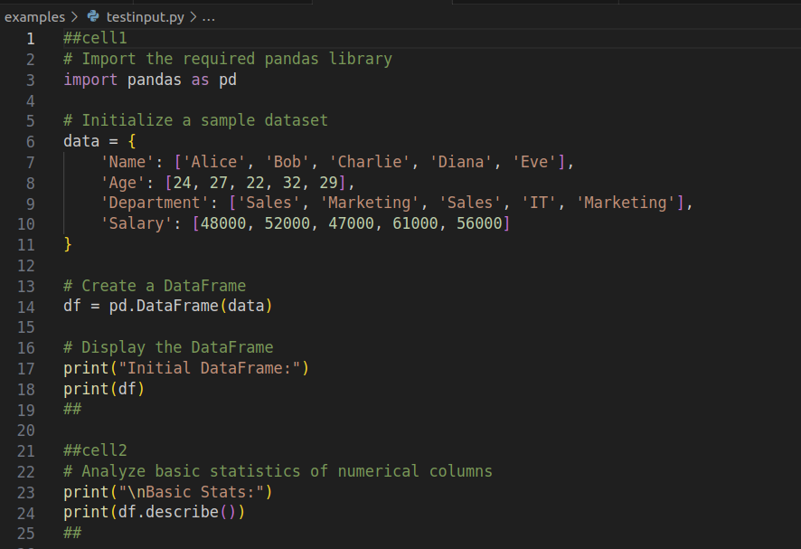
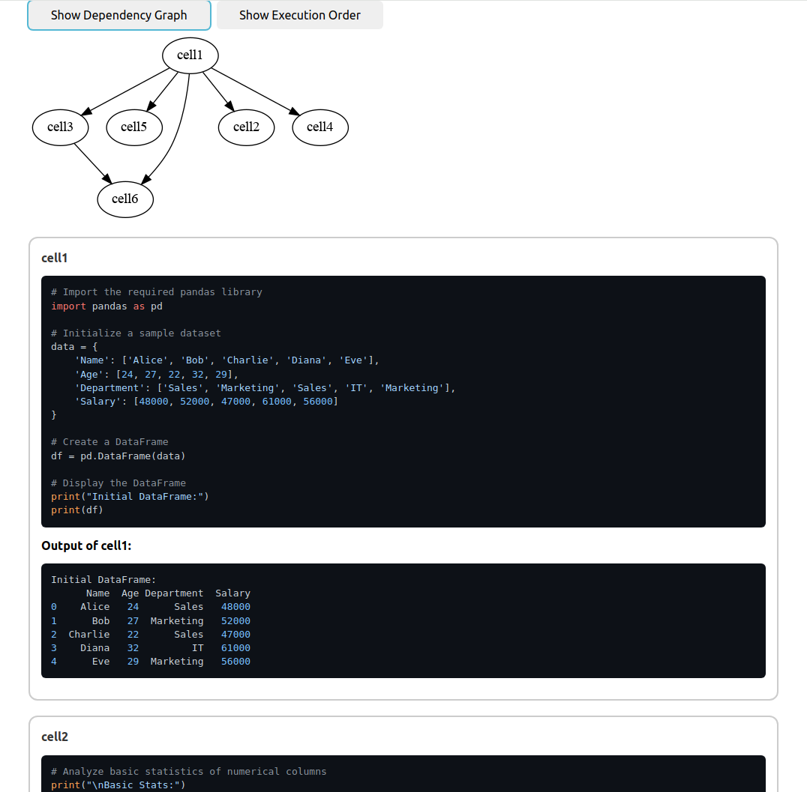

### Python Notebook Simulator

The Python Notebook Simulator is a project designed to help learn how deterministic and reproducible execution works in Python-like notebook environments. 

By organizing Python code into well-defined cells using familiar Python comments (e.g., ##cellid and ##), it enables clear and structured execution. The simulator examines the dependencies between these "cells" to establish a fixed order in which they should be executed, ensuring that every run of the script yields the same results under identical conditions.

Furthermore, the simulator helps visualize dependencies among code cells. This visualization shows how each cell is interconnected, providing insights into the flow of data and the impact of each section of code on subsequent computations. After execution, the simulator generates an HTML file that captures both the output and the visual graphs of cell relationships. 

#### How Does It Work?

To define cells in your Python file, simply start each cell with a `##cell` comment and end it with another comment like `##`. This marks the boundaries of each cell.
It analyzes dependencies and execute your cells in the right order. Dependency and execution graphs are automatically created. Get your results in an HTML file, including both your output and the graphs.

<p align="center">
  
  
</p>


### Getting Started

#### Clone the Repository

To get started with the Python Notebook Simulator, you'll first need to clone the repository to your local machine. You can do this by opening your terminal or command prompt and running the following command:

```bash
git clone https://github.com/vrtnis/python-notebook-simulator.git
cd python-notebook-simulator
```


#### Install Dependencies 

```
pip install -r requirements.txt
```

#### Run It!

```
python main.py -i ./examples/testinput.py

```
#### Community

To learn more about concepts such as deterministic and reproducible execution, ask questions and connect with other Python enthusiasts, consider joining the [marimo Discord server](https://discord.gg/JE7nhX6mD8). [marimo](https://marimo.io) revolutionizes how we think about Python notebooks. marimo notebooks are reproducible, extremely interactive, designed for collaboration (git-friendly!), deployable as scripts or apps. 


